# Bandwidth Measurement System - Architecture Diagrams

This document contains visual architecture diagrams in Mermaid format that can be rendered in Markdown viewers that support Mermaid (GitHub, GitLab, many documentation tools).

## System Overview

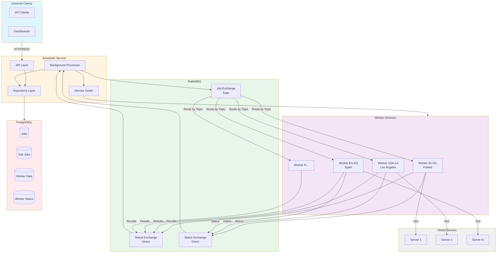

## Job Creation and Processing Flow

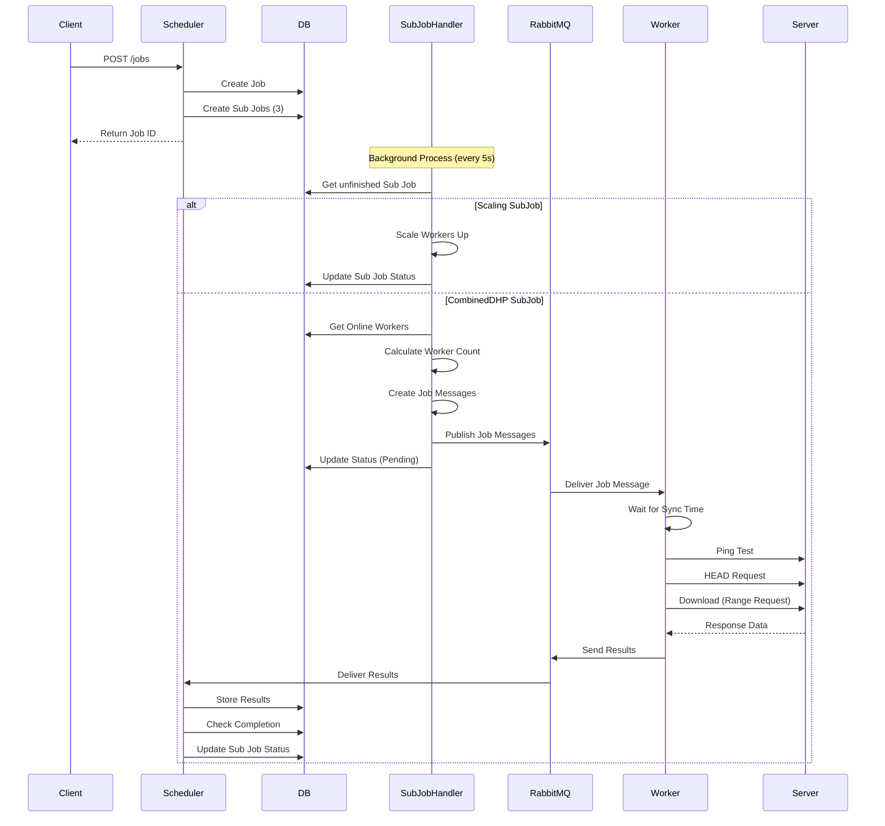

## RabbitMQ Message Flow

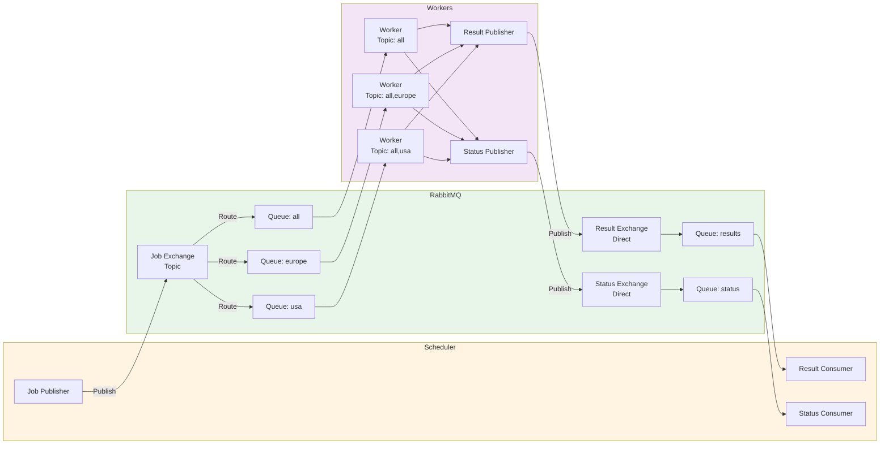

## Worker Execution Flow

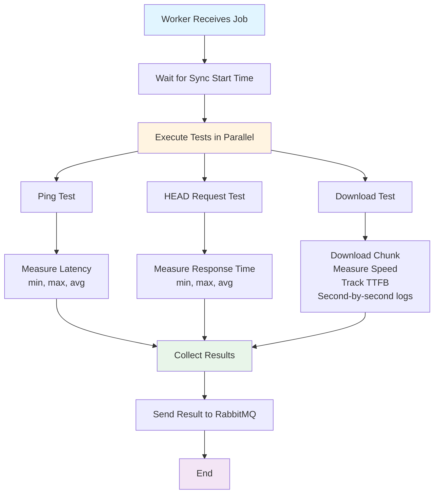

## Sub Job Processing State Machine

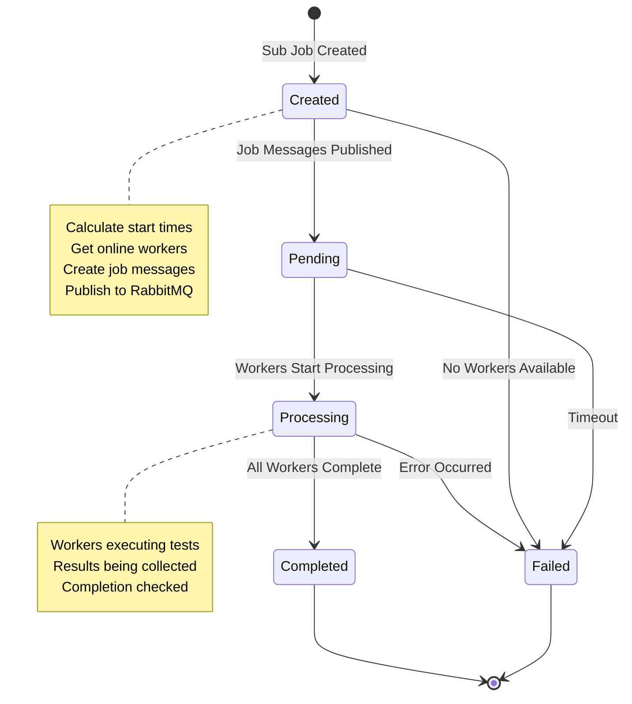

## Worker Scaling Flow

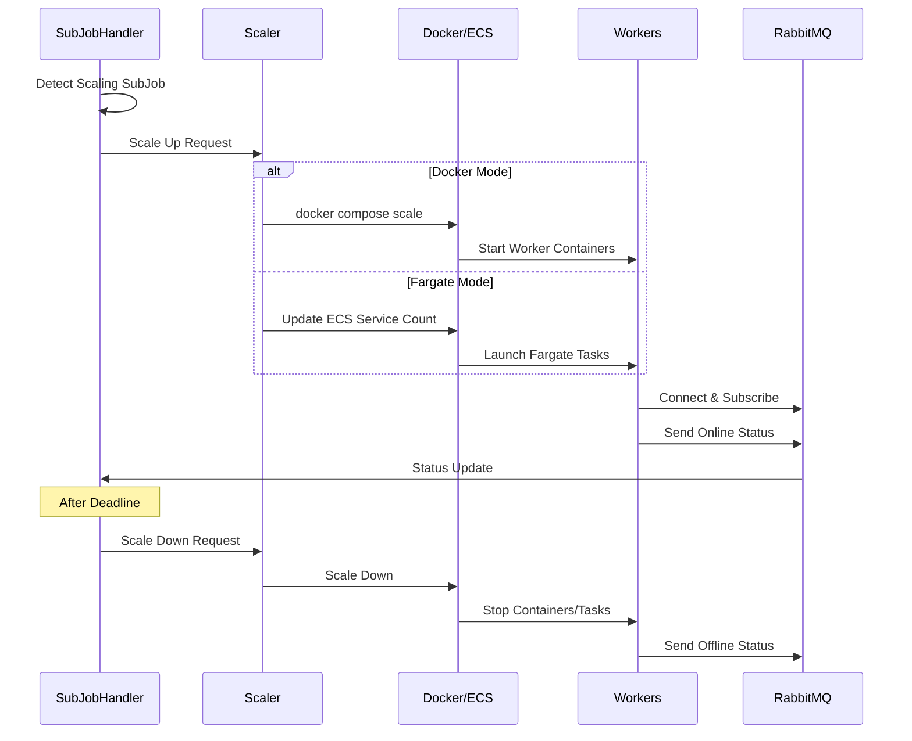

## Data Aggregation Flow

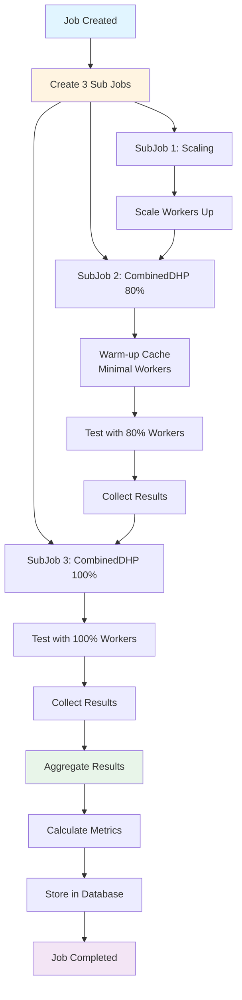

## Component Architecture

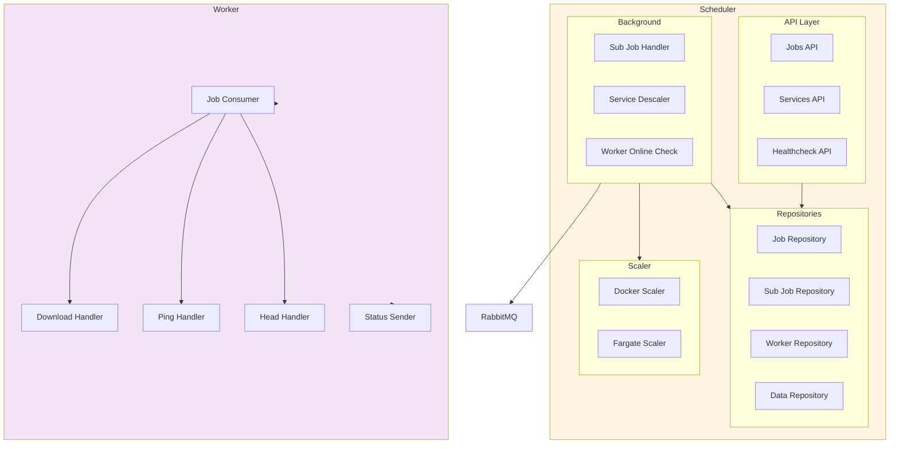

## Database Schema Relationships

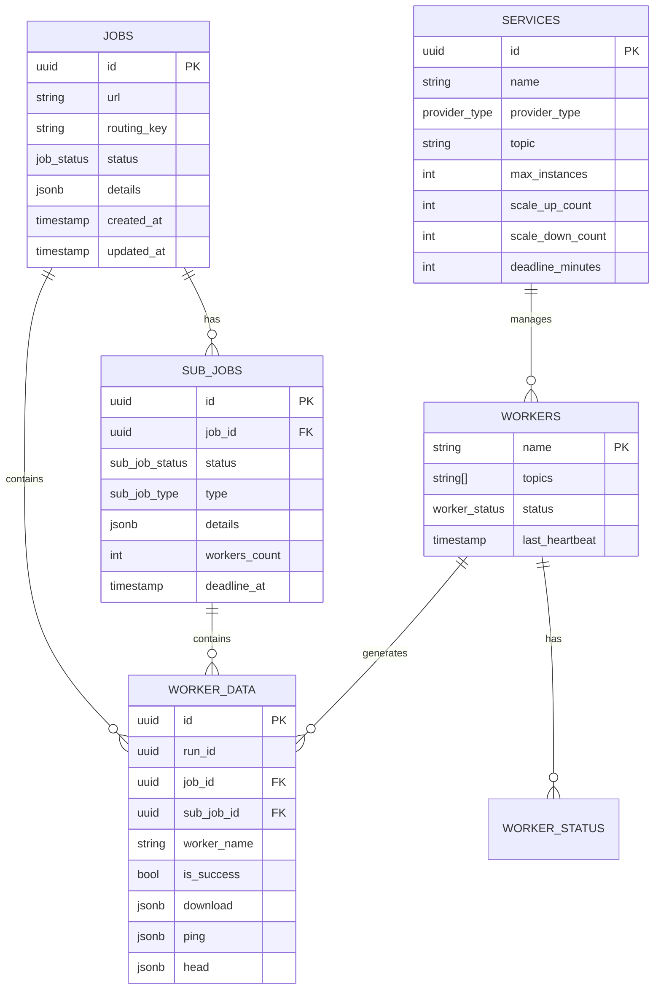

## Error Handling Flow

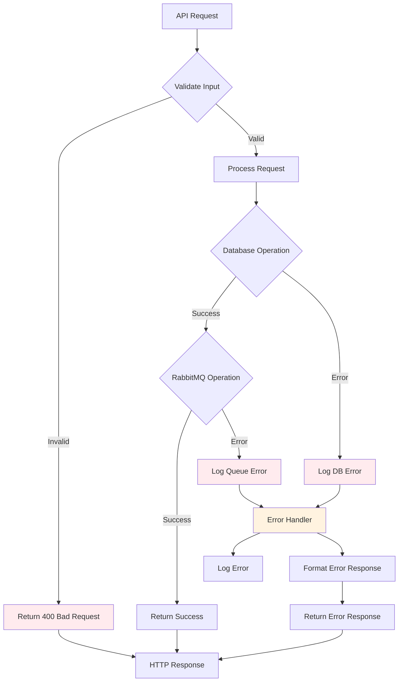

## Worker Lifecycle

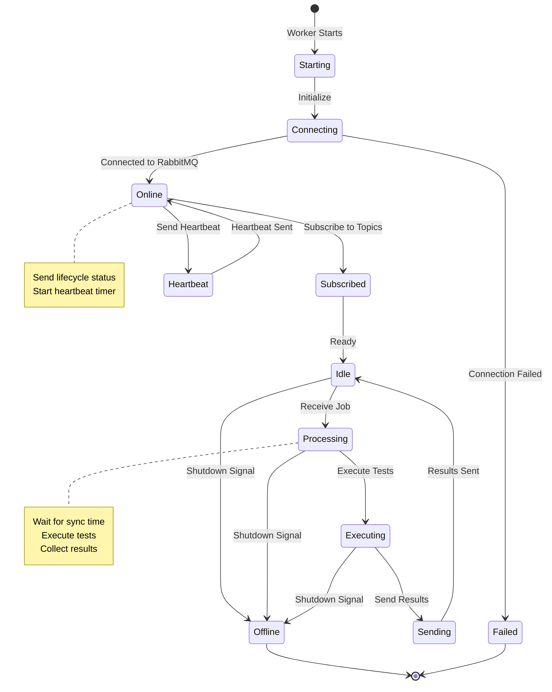

## Deployment Architecture

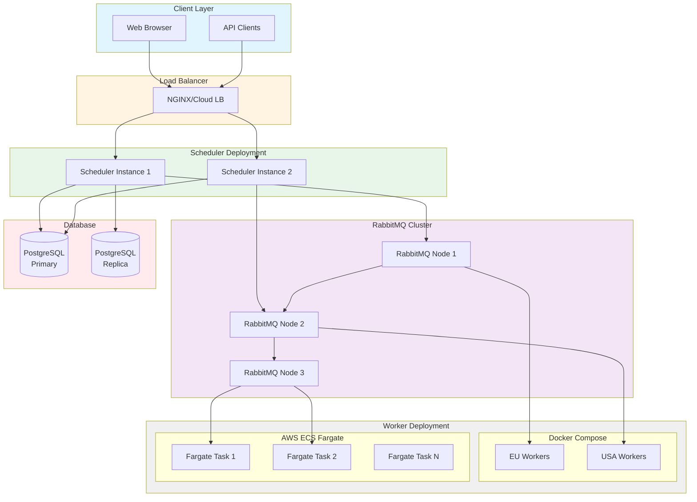

## Test Execution Timeline

```mermaid
gantt
    title Bandwidth Test Execution Timeline
    dateFormat HH:mm:ss
    axisFormat %H:%M:%S
    
    section Job Creation
    Create Job           :done, create, 00:00:00, 1s
    Create Sub Jobs      :done, subjobs, after create, 1s
    
    section Scaling
    Scale Workers Up    :active, scale, 00:00:01, 30s
    
    section SubJob 1 (80% Workers)
    Warm-up Cache       :warmup, 00:00:31, 10s
    Test Execution      :test80, after warmup, 60s
    Result Collection   :collect80, after test80, 5s
    
    section SubJob 2 (100% Workers)
    Test Execution      :test100, after collect80, 60s
    Result Collection   :collect100, after test100, 5s
    
    section Completion
    Aggregate Results   :agg, after collect100, 5s
    Job Complete        :done, complete, after agg, 1s
```

## Message Types

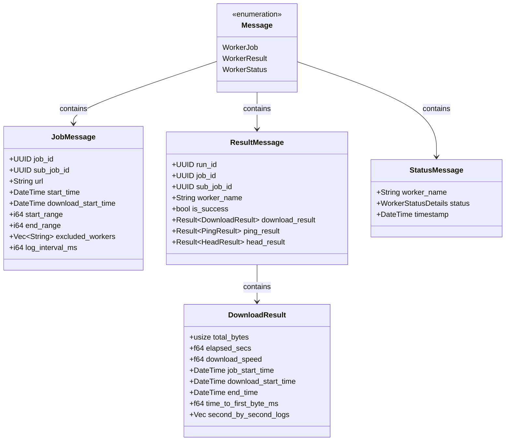
