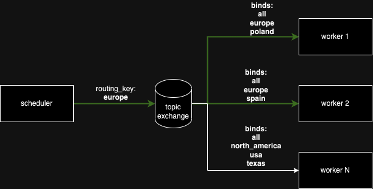
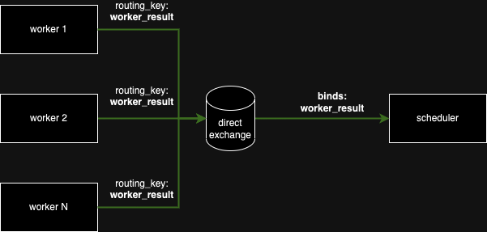

# Bandwidth Measurement System (BMS)

## Table of Contents
  - [Introduction](#introduction)
  - [API Documentation](#api-documentation)
  - [Architecture Overview](#architecture-overview)
    - [Infrastructure](#infrastucture)
    - [Environment variables](#environment-variables)
    - [Dev Setup](#dev-setup)
    - [RabbitMQ Communication](#rabbitmq-communication)
  - [Methodology of Measurement](#methodology-of-measurement)
    - [Testing Objectives](#testing-objectives)
    - [Testing Stages](#testing-stages)
    - [Techniques](#techniques)
    - [Objectives of Testing Stages](#objectives-of-testing-stages)
      - [Setting number of workers](#setting-number-of-workers)
      - [Setting file parameters](#setting-file-parameters)
      - [Scaling the number of workers](#scaling-the-number-of-workers)
      - [Running warm up cache](#running-warm-up-cache)
      - [Test with 80% workers](#test-with-80-workers)
    - [Known issues](#known-issues)
      - [Too fast bandwidth](#too-fast-bandwidth)
      - [TCP ramp up time](#tcp-ramp-up-time)
  - [Test Cases](#test-cases)

## Introduction

The Bandwidth Measurement System (BMS) is a tool that measures the bandwidth of a server's network connection. The measurements are taken by downloading a file in random range from a server. The measurements are taken with set N amount of workers, each attempt to download a file, making simultaneously N downloads. The BMS is designed for a distributed environment where any tested server can be located at different regions.

## API Documentation
The API documentation is available in form of swagger UI at [https://bms.allocator.tech/swagger-ui/](https://bms.allocator.tech/swagger-ui/)

## Architecture Overview

### Infrastucture

- Scheduler (Rust)
- Worker (Rust)
- PostgresSQL
- RabbitMQ

### Environment variables

Example env file: [.env.example](./.env.example)

Global ENV:

- `DATABASE_URL`: URI to the PostgresSQL database
- `RABBITMQ_ENDPOINT`: Endpoint of the RabbitMQ server (host:port)
- `RABBITMQ_USERNAME`: Username to authenticate with RabbitMQ
- `RABBITMQ_PASSWORD`: Password to authenticate with RabbitMQ
- `LOG_LEVEL`: Log level of the application (debug, info, warn, error) - default: info

Worker ENV:

- `WORKER_NAME`: Unique identifier of the worker, user to bind to the queue
- `WORKER_TOPICS`: Comma separated list of topics the worker is interested in (All workers are interested in the `all` topic)
- `HEARTBEAT_INTERVAL_SEC` (optional): Interval in seconds between sending heartbeats to the scheduler - default: 5

### Dev Setup

1. `cp .env.example .env` to create the env file
1. `ln -s "$PWD" /tmp/bms` to create symlink to shared storage between the scheduler and the host
1. `docker compose up -d rabbitmq` to start the RabbitMQ (needs to be started before the application)
1. `docker compose up -d` to start the PostgresSQL, scheduler and static worker
1. `WORKER_NAME=worker_manual WORKER_TOPICS=all,europe,poland cargo run --bin worker` to start additional worker

### RabbitMQ Communication

#### Job Exchange

#### Result Exchange

## Methodology of Measurement

### Testing Objectives

- Check or Verify server bandwidth.
- Latency of the server.

### Testing Stages

1. Setting number of workers to run the test.
1. Setting parameters for the file that will be downloaded by all subsequent workers
    - Range of the sample
    - Size of the sample
1. Scaling the number of workers in specific region(s) required for the test.
1. Running warm up cache consisting of minimal amount of workers.
1. Running test with most of the workers (e.g. 80%)
1. Running test with all the workers

### Techniques

- Each worker is running in separate server (removing outbound bandwidth limitations)
- Synchronized sampling time window
- The same range request, randomized once for all workers.
- Fixed max duration
- Warm up cache (remove cold start, HDD limitations)
- Runs with 80% and 100% of workers

### Objectives of Testing Stages 

#### Setting number of workers

The number of workers is set according to the test requirements.
This number will be referred as 100% of workers or all workers in the subsequent stages.

#### Setting file parameters

The service is using range request to download only a part of the file.
The range is picked in random manner where size is constant.

#### Scaling the number of workers

Currently the service is using 3 regions for testing. 
The number of workers in each region is scaled according to the test requirements.
Workers are scaled up to complete the job, workers will be descaled after set time

#### Running warm up cache

In order to get the best results in subequent runs, the service is running a warm up cache download process with minimal amount of workers.

#### Test with 80% workers

First of two main tests. The service is running with limited amount of workers and measures the bandwidth.
This test should give a good indication of the bandwidth of the server.
Most of the servers, should saturate the bandwidth at this point.

#### Test with 100% workers

Second of two main tests. The service is running with all workers and measures the bandwidth.
This test should show if we did in fact saturate the server bandwidth.
In case the result is similar to the previous test, we can assume that the servers bandwidth is saturated or the server is limited by other factors.

### Known Issues

#### Too fast bandwidth
Due to how current calculations work, servers with very fast bandwidth might have higher bandwidth measurements than in reality.
This is due to the fact that the service is intended to saturate servers bandwidth by spawning large amount of workers.
If some of the workers finish faster than others, the rest of the workers will have higher bandwidth measurements as some of the pressure is taken off the server and can be distributed to the rest of the workers.

## Test Cases 

### Controlled “Base Case” (AWS S3 close to workers)

#### Without warm-up cache  
- **Job ID:** `75579f18-65d8-4c61-9a92-fe51ea6bd7c5`  
- **URL:** https://bms.allocator.tech/jobs/75579f18-65d8-4c61-9a92-fe51ea6bd7c5  
- **File:** https://ahnawee8-xupio2pi-production.s3.us-east-1.amazonaws.com/test.zip  
- **Workers:** 10  
- **Speeds (Mbps):**  
  - 80% workers: 3595
  - 100% workers: 7650

#### With warm-up cache  
- **Job ID:** `109e43f4-dc51-44df-8ce6-591ec169a130`  
- **URL:** https://bms.allocator.tech/jobs/109e43f4-dc51-44df-8ce6-591ec169a130
- **File:** https://ahnawee8-xupio2pi-production.s3.us-east-1.amazonaws.com/test.zip  
- **Workers:** 10  
- **Speeds (Mbps):**  
  - 80% workers: 6225
  - 100% workers: 7742

**Description:** Ideal network conditions with minimal latency. Warm-up caching yields a ~ 70% boost in measured throughput by eliminating cold-start penalties.

---

### Very Low Bandwidth (≪ 1 Gb/s)

- **File:** http://222.214.219.199:7777/piece/baga6ea4seaqllr6klqlddwkdj4jklvf7owoupjygz7rvs2aih4iowzmw7xvlefq  
- **Job ID:** `041b3bbb-48e7-4ee1-8254-2218698ea01e`
- **URL:** https://bms.allocator.tech/jobs/041b3bbb-48e7-4ee1-8254-2218698ea01e
- **Region:** us_east  
- **Workers:** 10  
- **Speeds (Mbps):**  
  - 1% workers: 1.76  
  - 80% workers: 10.45  
  - 100% workers: 11.96  
- **Description:** Server is heavily constrained (single-digit throughput). Useful to identify very slow hosts or those behind strict egress limits.

---

### Physical Cap / Intentional Throttle (~ 1 Mbps)

- **File:** http://47.236.144.226:58420/piece/baga6ea4seaqnobhiy4ixfw466pn4fjx6ft3q4av4t62jqiyltugbggxgv5q5cfi  
- **Job ID:** `a408fc36-b06f-4849-98f4-573b8181fd84`
- **URL:** https://bms.allocator.tech/jobs/a408fc36-b06f-4849-98f4-573b8181fd84
- **Region:** us_east  
- **Workers:** 10  
- **Speeds (Mbps):**  
  - 1% workers: 1.06  
  - 80% workers: 1.06  
  - 100% workers: 1.06  
- **Description:** Nearly identical speeds at all scales indicate either a strict server-side throttle or extremely limited physical link.

---

### High-Bandwidth with Anomalies

- **File:** http://203.160.91.76:11876/piece/baga6ea4seaqeegsfeyqlyvccmnklnxab2sl3da7zsguqgaq7gc57fthps2ndudi  
- **Job ID:** `bfc91625-a85a-4806-b066-54b6cf5d9acd`  
- **URL:** https://bms.allocator.tech/jobs/bfc91625-a85a-4806-b066-54b6cf5d9acd
- **Region:** singapore  
- **Workers:** 10
- **Speeds (Mbps):**  
  - 1% workers: 538.7  
  - 80% workers: 2523.2  
  - 100% workers: 1625.6  
- **Job ID:** `8fc0e53e-5f1e-4e7b-b539-66502407b6f1`  
- **URL:** https://bms.allocator.tech/jobs/8fc0e53e-5f1e-4e7b-b539-66502407b6f1
- **Region:** singapore  
- **Workers:** 10
- **Speeds (Mbps):**  
  - 1% workers: 567.7  
  - 80% workers: 2134.5  
  - 100% workers: 3186.3  
- **Job ID:** `2c4664c4-6c17-40ef-9a2a-8468babaa27c`  
- **URL:** https://bms.allocator.tech/jobs/2c4664c4-6c17-40ef-9a2a-8468babaa27c
- **Region:** hong_kong
- **Workers:** 10  
- **Speeds (Mbps):**  
  - 1% workers: 813.8  
  - 80% workers: 5206.1  
  - 100% workers: 3120.3
- **Description:** In some test bandwidth peaks at 80% then drops at full scale—suggests the test didn’t fully saturate the link, possibly indicating server limitations with high cap.

---

### Mid-Bandwidth, Consistent Saturation

- **URL:** http://103.1.65.126:18924/piece/baga6ea4seaqes7feukheece5e55rwtmz7uahlde4xo6zy3okth53jt4vkj2f6fa  
- **Job ID:** `37333d94-3012-4bcc-9bfd-4d15873af31b`  
- **URL:** https://bms.allocator.tech/jobs/37333d94-3012-4bcc-9bfd-4d15873af31b
- **Region:** us_east  
- **Workers:** 10
- **Speeds (Mbps):**  
  - 1% workers: 99.3  
  - 80% workers: 737.5  
  - 100% workers: 750.4  
- **Description:** Bandwidth scales smoothly from single to full load—network link saturates neatly around 750 Mbps.

---

### Edge Case: Zero Results at Full Scale **[▪️ rerun with more workers]**

- **URL:** http://203.160.91.76:11876/piece/baga6ea4seaqeegsfeyqlyvccmnklnxab2sl3da7zsguqgaq7gc57fthps2ndudi  
- **Job ID:** `c588366d-42b4-4227-8250-6e4898aac41e`  
- **Region:** hong_kong  
- **Speeds (Mbps):**  
  - 1% workers: 792.1  
  - 80% workers: 0  
  - 100% workers: 0  
- **Description:** Full-scale test returned no data—likely worker failures under load. **Rerun with additional workers** or check RabbitMQ/worker stability.

---

